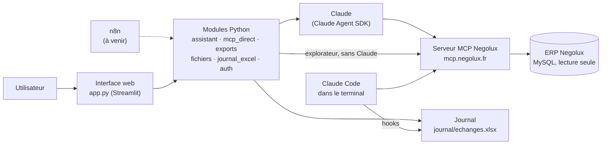

# negolux-ia

Projet de connexion d'une base de données et de ses données via un MCP et n8n.

`negolux-ia` interroge l'ERP **Negolux** (base MySQL, en lecture seule) à travers le **serveur MCP Negolux** et **Claude**. Il regroupe :

- une **interface web** (Streamlit) : on pose une question en français, Claude interroge l'ERP et répond. Chaque réponse s'exporte en PDF, Excel ou CSV ;
- un **journal** Excel de toutes les questions et réponses, qu'elles viennent de l'interface ou de Claude Code dans le terminal ;
- des **analyses** faites avec Claude Code, par exemple la prévision du CA 2027 ;
- des **modules Python réutilisables**, base de la future intégration à **n8n**.

> **Confidentialité** : ce dépôt contient des chiffres de l'ERP. Il doit être **privé** sur GitHub. Les secrets (`.env`), les comptes (`comptes.json`) et le journal (`journal/`) ne sont jamais versionnés.

## Sommaire

- [Architecture](#architecture)
- [Installation](#installation)
- [Interface web](#interface-web)
- [Journal des échanges](#journal-des-échanges)
- [Claude Code dans le terminal](#claude-code-dans-le-terminal)
- [Prévision du CA](#prévision-du-ca)
- [Utiliser les modules en Python](#utiliser-les-modules-en-python)
- [Intégration à n8n (à venir)](#intégration-à-n8n-à-venir)
- [Structure du dépôt](#structure-du-dépôt)
- [Dépannage](#dépannage)
- [Historique](#historique)

## Architecture



- **Claude ne voit que les outils du MCP** : dans l'interface, l'assistant n'a accès ni aux fichiers ni aux commandes du poste. Les pièces jointes lui sont transmises dans la question.
- **Le serveur MCP est en lecture seule** : aucune écriture n'est possible dans l'ERP.
- **La logique est dans des modules Python indépendants de l'interface**, pour pouvoir être appelée plus tard depuis n8n.

## Installation

Il faut :
- Windows avec PowerShell 7, ou tout système avec Python 3.11 ou plus récent ;
- Git ;
- [Claude Code](https://code.claude.com/docs), installé et connecté à ton compte Claude, pour l'assistant ;
- une clé d'accès au serveur MCP Negolux.

```powershell
git clone https://github.com/AurelienGEORGES/negolux-ia.git
cd negolux-ia
.\lancer.ps1
```

Au premier lancement, `lancer.ps1` :
1. crée l'environnement Python `.venv` et installe `requirements.txt`. Il réinstalle les dépendances chaque fois que ce fichier change ;
2. crée `.env` à partir de `.env.example`, puis s'arrête. Renseigne la clé du MCP dans `.env` et relance.

### Configuration (`.env`)

| Variable | Rôle |
|---|---|
| `MCP_URL` | Adresse du serveur MCP (par défaut `https://mcp.negolux.fr/mcp`) |
| `MCP_API_KEY` | Clé du serveur MCP, obligatoire |
| `ANTHROPIC_API_KEY` | Facultatif : à utiliser si Claude Code n'est pas connecté à un compte Claude |

## Interface web

`.\lancer.ps1` ouvre l'interface sur http://localhost:8501. Elle n'est accessible que depuis le poste.

### Connexion

- **Premier lancement** : l'interface propose de créer le premier compte.
- **Comptes suivants** : ils se gèrent en ligne de commande :

  ```powershell
  .\.venv\Scripts\python auth.py ajouter <identifiant>     # créer un compte ou changer son mot de passe
  .\.venv\Scripts\python auth.py supprimer <identifiant>
  .\.venv\Scripts\python auth.py lister
  ```

- **Mots de passe** : ils sont stockés sous forme de hash (PBKDF2-SHA256) dans `comptes.json`. Les essais répétés sont ralentis.
- **Session** : elle se ferme quand on recharge la page.

### Onglet Assistant

- **Poser une question** en français. Claude choisit les outils du MCP, affiche les appels et les données brutes, puis répond.
- **Joindre des fichiers** avec le bouton « + » de la zone de saisie : Excel (`.xlsx`, `.xlsm`), CSV, PDF ou texte. Leur contenu est transmis à Claude avec la question.
  - Limites : environ 60 000 caractères par fichier et 150 000 au total.
  - Les PDF scannés, sans texte, ne sont pas lisibles.
- **Télécharger la réponse** avec les boutons sous chaque réponse :

  | Format | Contenu |
  |---|---|
  | PDF | La question, la réponse et ses tableaux |
  | Excel | Une feuille par tableau de la réponse, plus les données brutes renvoyées par les outils MCP |
  | CSV | Un fichier par tableau, au format d'Excel en français (`;`, virgule décimale) |

  Si la question parle d'Excel, de CSV ou de PDF, le bouton correspondant est mis en avant.
- **Choisir le modèle** (Sonnet, Opus, Haiku) et démarrer une nouvelle conversation depuis la barre latérale.

### Onglet Explorateur MCP

Il appelle directement les outils du serveur MCP, sans Claude. Il sert à tester un outil ou à extraire des données brutes, avec un export Excel ou CSV des résultats.

### Onglet Journal

Il affiche le journal des échanges. On peut :
- filtrer ses propres questions ;
- ouvrir un échange complet ;
- télécharger le classeur ;
- le reconstruire.

## Journal des échanges

Chaque question posée à Claude et sa réponse sont ajoutées à `journal/echanges.xlsx`, qu'elles viennent de l'interface ou du terminal.

| Colonne | Contenu |
|---|---|
| Date question, Date réponse, Durée | Horodatage de l'échange |
| Source | `interface` ou `terminal` (plus tard `n8n`) |
| Utilisateur | Compte connecté à l'interface, ou utilisateur du poste pour le terminal |
| Session | Identifiant de la conversation Claude |
| Question, Pièces jointes, Réponse | L'échange lui-même |
| Outils utilisés | Par exemple `stats_commandes ×2, executer_requete_sql` |
| Statut | `répondu`, `interrompu`, `sans réponse` ou `erreur` |

Fonctionnement :
- **Source de vérité** : `journal/echanges.jsonl`, avec une ligne JSON par échange. Le classeur est régénéré à partir de ce fichier après chaque ajout.
- **Classeur ouvert dans Excel** : l'échange est quand même conservé. Le classeur est rattrapé à l'échange suivant, avec le bouton « Reconstruire », ou avec `python journal_excel.py`.
- **Écritures simultanées** : un verrou empêche deux écritures en même temps (interface et terminal, ou plusieurs sessions).

## Claude Code dans le terminal

Ouvrir Claude Code dans le dossier du dépôt (`claude`) donne accès :
- **au contexte de `CLAUDE.md`** : les outils MCP à utiliser, les définitions (CA TTC, retard des avoirs…) et la procédure de mise à jour des données ;
- **au journal automatique**, grâce aux hooks de `.claude/settings.json`. Il faut Python avec `openpyxl` dans le PATH et, sous Windows, Git pour Windows (Git Bash), qui lance les hooks. Les erreurs sont notées dans `journal/erreurs.log` ; elles ne bloquent jamais Claude Code.

## Prévision du CA

```powershell
.\.venv\Scripts\python prevision\prevision_ca.py   # fin d'année en cours, backtests, scénarios N+1
.\.venv\Scripts\python prevision\par_canal.py      # détail canal par canal
```

- **Méthode et résultats** : `docs/prevision-2027.md`. L'estimation centrale est d'environ 14,4 M€ TTC, dans une fourchette de 13,9 à 15,3 M€.
- **Mettre à jour les données** : dans Claude Code, demander « mets à jour les données de prévision ». La procédure est dans `CLAUDE.md`.

## Utiliser les modules en Python

Les modules ne dépendent pas de Streamlit : on peut les appeler depuis un script, et demain depuis n8n. Les exemples ci-dessous se lancent à la racine du dépôt, avec le `.env` rempli.

**Extraire des données du MCP vers Excel, sans Claude :**

```python
import asyncio
import os

from dotenv import load_dotenv

import exports
from mcp_direct import appeler_outil

load_dotenv()
resultat = asyncio.run(appeler_outil(
    os.environ["MCP_URL"], os.environ["MCP_API_KEY"], "stats_commandes",
    {"date_debut": "2026-01-01", "date_fin": "2026-08-31", "regroupement": "canal"},
))
tableaux = exports.tableaux_outils([{"nom": "stats_commandes", "texte": resultat["texte"]}])
with open("ca_par_canal.xlsx", "wb") as f:
    f.write(exports.en_excel(tableaux))
```

**Poser une question à Claude et produire le rapport PDF :**

```python
import asyncio
import os
from datetime import datetime

from dotenv import load_dotenv

import exports
from assistant import poser_question

load_dotenv()
question = "Quel est le CA de juillet 2026 par canal ?"
textes, appels = [], {}

def rappel(evenement, donnees):  # reçoit les évènements texte, outil, resultat, fin
    if evenement == "texte":
        textes.append(donnees["texte"])
    elif evenement == "outil":
        appels[donnees["id"]] = donnees
    elif evenement == "resultat" and donnees["id"] in appels:
        appels[donnees["id"]]["texte"] = donnees["texte"]

asyncio.run(poser_question(question, os.environ["MCP_URL"], os.environ["MCP_API_KEY"], None, None, rappel))
fichiers = exports.preparer(question, "\n\n".join(textes), list(appels.values()), "script", datetime.now())
with open(f"{fichiers['base']}.pdf", "wb") as f:
    f.write(fichiers["pdf"])
```

**Ajouter un échange au journal :**

```python
import journal_excel

journal_excel.ajouter([{
    "date_question": "2026-09-24T10:00:00", "date_reponse": journal_excel.maintenant(),
    "source": "script", "utilisateur": "aurel", "session": "", "question": "…",
    "pieces_jointes": "", "reponse": "…", "outils": "stats_commandes", "statut": "répondu",
}])
```

| Module | Fonctions principales |
|---|---|
| `mcp_direct` | `lister_outils`, `appeler_outil`, `verifier_sante` |
| `assistant` | `poser_question(question, url, cle_api, modele, session_id, rappel)` |
| `fichiers` | `extraire_texte(nom, contenu)`, `question_avec_pieces(question, pieces)` |
| `exports` | `tableaux_markdown`, `tableaux_outils`, `en_excel`, `en_csv`, `en_pdf`, `preparer` |
| `journal_excel` | `ajouter`, `lire`, `reconstruire` |
| `auth` | `enregistrer_compte`, `verifier`, `supprimer_compte` |

## Intégration à n8n (à venir)

**Objectif** : que des workflows n8n utilisent les mêmes modules que l'interface. Exemples : un rapport PDF mensuel envoyé par e-mail, une extraction Excel planifiée, une alerte quand un canal décroche. Ces appels iront dans le même journal, avec la source `n8n`.

### Façons d'appeler le module Python depuis n8n

| Nœud n8n | Principe | Avantages | Limites |
|---|---|---|---|
| **HTTP Request** (recommandé) | Une petite API HTTP (FastAPI) expose les modules ; n8n l'appelle | Fonctionne où que tourne n8n (Docker, autre machine) ; interface claire ; protégeable par clé | Un service de plus à lancer |
| **Execute Command** | n8n lance `python -m negolux …` et lit le JSON renvoyé | Rien à héberger en plus | n8n auto-hébergé seulement ; la commande s'exécute là où tourne n8n (dans le conteneur s'il est en Docker) ; nœud souvent désactivé par défaut |
| **Code (Python)** | Le code est collé dans le workflow | — | Bac à sable : importer ces modules et leurs dépendances (pandas, mcp, Agent SDK) demande une image n8n sur mesure. Déconseillé |

### Feuille de route

- [ ] **Regrouper les modules** dans un paquet `negolux/` installable (`pip install -e .`), que l'interface et les hooks importeront.
- [ ] **Ligne de commande** `python -m negolux`, avec entrée et sortie en JSON : `question`, `outil`, `journal`.
- [ ] **API HTTP** (FastAPI), protégée par une clé et accessible seulement en local ou sur le réseau Docker de n8n :
  - `POST /question` : question et pièces jointes → réponse, outils utilisés, fichiers PDF/Excel/CSV ;
  - `POST /outil` : appel direct d'un outil MCP → données brutes et export Excel/CSV ;
  - `GET /journal` : échanges du journal, filtrables par date, source ou utilisateur.
- [ ] **Source `n8n`** dans le journal, avec le nom du workflow comme utilisateur.
- [ ] **Exemples de workflows** exportés dans `n8n/` : rapport mensuel par e-mail, extraction planifiée.
- [ ] **Clé API Anthropic** (`ANTHROPIC_API_KEY`) pour les appels automatisés, plutôt que la connexion d'un compte Claude.

Proposition de format pour `POST /question` (à confirmer au moment du développement) :

```json
{
  "question": "CA du mois dernier par canal, en Excel",
  "utilisateur": "n8n:rapport-mensuel",
  "formats": ["xlsx", "pdf"]
}
```

Réponse :

```json
{
  "reponse": "Voici le CA d'août 2026 par canal…",
  "outils": "stats_commandes",
  "fichiers": {"xlsx": "<base64>", "pdf": "<base64>"},
  "journal": 42
}
```

## Structure du dépôt

| Élément | Rôle |
|---|---|
| `app.py` | Interface web Streamlit : assistant, explorateur MCP, journal |
| `assistant.py` | Appel de Claude (Claude Agent SDK) avec les seuls outils du MCP Negolux |
| `mcp_direct.py` | Client MCP direct (Streamable HTTP + clé Bearer), sans Claude |
| `auth.py` | Comptes, écran de connexion, gestion des comptes en ligne de commande |
| `fichiers.py` | Lecture des pièces jointes (Excel, CSV, PDF, texte) |
| `exports.py` | Extractions en PDF, Excel et CSV |
| `journal_excel.py` | Journal commun à l'interface et au terminal |
| `lancer.ps1` | Lancement de l'interface sous Windows |
| `.env.example` | Modèle du fichier de configuration `.env` |
| `.claude/` | Hooks Claude Code qui alimentent le journal depuis le terminal |
| `CLAUDE.md` | Contexte chargé par Claude Code dans le terminal |
| `data/` | Données extraites de l'ERP pour la prévision |
| `prevision/` | Scripts de prévision du CA |
| `docs/` | Analyses et notes de méthode |
| `archives/` | Premières versions des scripts d'analyse |

Non versionnés : `.env`, `.venv/`, `comptes.json`, `journal/`.

## Dépannage

| Problème | Solution |
|---|---|
| `ERROR: unknown command "…\pip.exe"` | Appeler pip à travers Python : `python -m pip install -r requirements.txt` |
| `lancer.ps1 … n'est pas signé numériquement` | Retirer la marque « téléchargé » : `Unblock-File .\lancer.ps1` |
| `ImportError: cannot import name 'streamablehttp_client'` | `mcp` 2.x est installé : `python -m pip install "mcp<2"` |
| L'onglet Assistant affiche une erreur | Vérifier que Claude Code est installé et connecté (`claude --version`), et que la clé MCP est renseignée |
| Le journal ne se remplit pas depuis le terminal | Vérifier `python --version` dans Git Bash, puis `/hooks` dans Claude Code |
| `echanges.xlsx` n'est pas à jour | Fermer Excel, puis « Reconstruire » dans l'onglet Journal, ou `python journal_excel.py` |

## Historique

- **Analyse de la base Negolux et prévision du CA 2027** : scripts de prévision, données et note de méthode.
- **Journal automatique** des questions et réponses de Claude Code dans Excel, grâce aux hooks.
- **Interface web unifiée** : connexion, pièces jointes, extractions PDF/Excel/CSV et journal commun avec le terminal.
- **À venir** : paquet Python `negolux/`, ligne de commande et API HTTP pour n8n.
